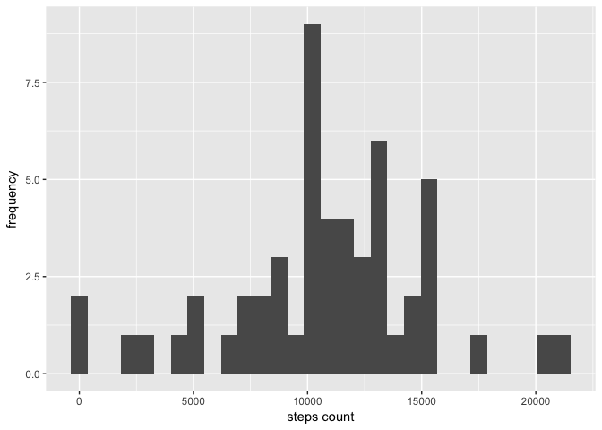
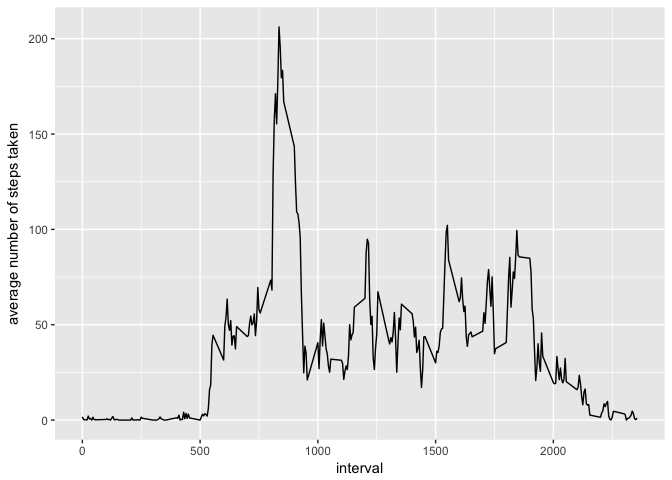
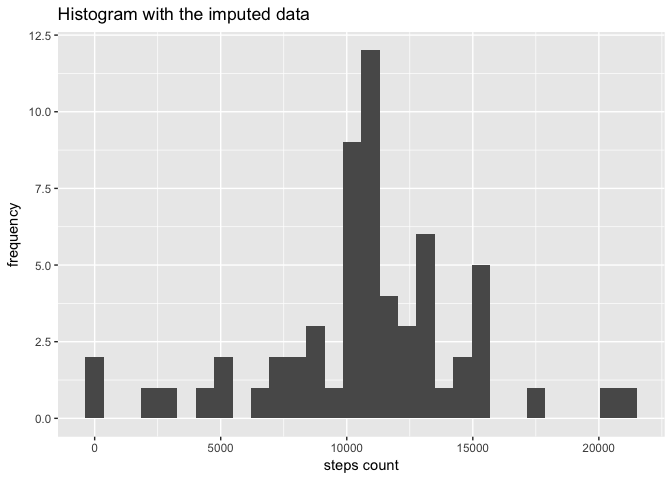
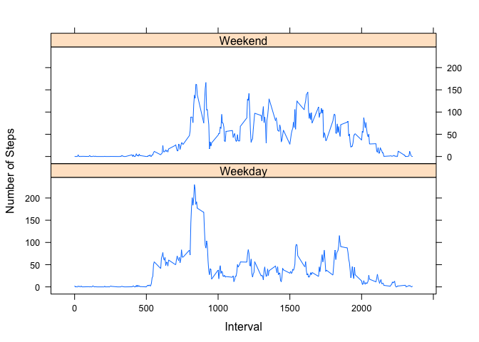

## Loading and preprocessing the data

```r
library(ggplot2)
```

```
## Warning: package 'ggplot2' was built under R version 3.3.2
```

```r
data <- read.csv(unz("activity.zip", "activity.csv"), header=T, quote="\"", sep=",")
d <- na.omit(data)
```

## What is mean total number of steps taken per day?

```r
sum_of_steps_per_day <- aggregate(d$steps, list(d$date), sum)
qplot(sum_of_steps_per_day$x, geom='histogram', xlab='steps count', ylab='frequency')
```

```
## `stat_bin()` using `bins = 30`. Pick better value with `binwidth`.
```

<!-- -->


```r
mean_of_steps_per_day <- mean(sum_of_steps_per_day$x)
median_of_steps_per_day <- median(sum_of_steps_per_day$x)
```

Mean of steps per day: 1.0766189\times 10^{4} 
Median of steps per day: 10765 

## What is the average daily activity pattern?

```r
average_of_steps_by_interval <- aggregate(d$steps, list(d$interval), mean)
qplot(average_of_steps_by_interval$Group.1, average_of_steps_by_interval$x, geom='line', xlab='interval', ylab='average number of steps taken')
```

<!-- -->

```r
max_interval <- average_of_steps_by_interval[which.max(average_of_steps_by_interval$x), 1]
```
5-minute interval on average across all the days in the dataset, contains 835 steps

## Imputing missing values

```r
total_number_of_nas <- sum(apply(data, 1, function(x) sum(is.na(x))))
```
Total number of missing values: 2304


```r
steps_by_interval<-function(interval) average_of_steps_by_interval$x[[which(average_of_steps_by_interval$Group.1 == interval)]]

new_data <- data
for(i in 1:nrow(new_data)){
    if(is.na(new_data[i,]$steps)){
        new_data[i,]$steps<-steps_by_interval(new_data[i,]$interval)
    }
}
new_sum_of_steps_per_day <- aggregate(new_data$steps, list(new_data$date), sum)
qplot(new_sum_of_steps_per_day$x, geom='histogram', xlab='steps count', ylab='frequency', main='Histogram with the imputed data')
```

```
## `stat_bin()` using `bins = 30`. Pick better value with `binwidth`.
```

<!-- -->


```r
new_mean_of_steps_per_day <- mean(new_sum_of_steps_per_day$x)
new_median_of_steps_per_day <- median(new_sum_of_steps_per_day$x)
difference_mean <- new_mean_of_steps_per_day - mean_of_steps_per_day
difference_median <- new_median_of_steps_per_day - median_of_steps_per_day
difference_steps <- sum(new_sum_of_steps_per_day$x) - sum(sum_of_steps_per_day$x)
```

Imputed Mean of steps per day: 1.0766189\times 10^{4} 
Imputed Median of steps per day: 1.0766189\times 10^{4} 
Difference between the means is 0, as the imputed values are the same of the average for each day.
Difference between the medians is 1.1886792
Difference in total steps is 8.6129509\times 10^{4}

## Are there differences in activity patterns between weekdays and weekends?

```r
library(lattice)
weekend <- c('Saturday', 'Sunday')
new_data$day <- ifelse(weekdays(as.Date(new_data$date)) %in% weekend, 'Weekend', 'Weekday')
new_average_of_steps_by_interval <- aggregate(steps ~ interval + day, new_data, mean)
library(lattice)
xyplot(steps~interval | day, data = new_average_of_steps_by_interval,
      type = 'l', xlab = 'Interval', ylab = 'Number of Steps', layout = c(1,2))
```

<!-- -->
